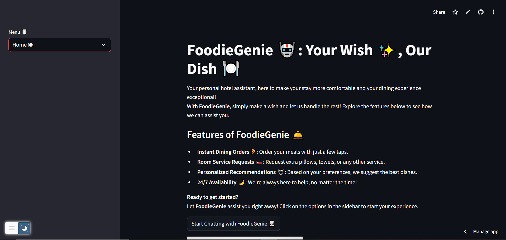

# 🍽️ FoodieGenie 🤖: Your Wish ✨, Our Dish  


**FoodieGenie** is a state-of-the-art AI-powered chatbot designed to enhance guest experiences in 5-star hotels. Whether it's placing dining orders, making special requests, or answering general queries, FoodieGenie makes hospitality personalized, efficient, and delightful.

---

## 🚀 Features

- **Instant Dining Orders** 🍕  
  Order meals effortlessly with simple text commands.  
 
- **Personalized Recommendations** 🤖  
  Receive dining suggestions tailored to your preferences.  

- **24/7 Availability** 🌙  
  Always available to assist, no matter the time.  

---

## 🖼️ Streamlit App Preview

Here’s a sneak peek of the **FoodieGenie** Streamlit interface:



---

## 🛠️ Tech Stack

- **Frontend**: [Streamlit](https://foodiegenie-chatbot-using-nlp.streamlit.app/)  
  A lightweight Python-based framework for building web apps.  

- **Natural Language Processing (NLP)**:  
  Utilizes `nltk` for text processing and `scikit-learn` for intent classification.  

- **Machine Learning Model**:  
  - **TfidfVectorizer**: Converts user input into numerical data for processing.  
  - **Logistic Regression**: Classifies user intents based on trained patterns.  

- **Backend**: Python  
  Handles chatbot logic, user input, and dynamic responses.  

- **Data**: `intents.json`  
  Custom dataset for training and responding to user inputs.  

---

## 📦 Installation

1. Clone the repository:
   ```bash
   git clone https://github.com/your-username/FoodieGenie.git
   cd FoodieGenie
   ```

2. Install dependencies:
   ```bash
   pip install -r requirements.txt
   ```

3. Download `nltk` data:
   ```python
   import nltk
   nltk.download("punkt")
   ```

4. Run the app:
   ```bash
   streamlit run FoodieGenie.py
   ```

5. Access the app at `http://localhost:8501` in your browser.  

---

## 🗂️ Project Structure

```
FoodieGenie/
├── foodie.png                 # Logo for the chatbot
├── intents.json               # Data file containing intents and responses
├── FoodieGenie.py             # Main Streamlit app file
├── README.md                  # Project documentation
├── requirements.txt           # Python dependencies
├── chat_log.csv               # Log of conversations (created during runtime)
```

---

## 🧑‍💻 Usage

1. Launch the chatbot using Streamlit.  
2. Select **Home** from the sidebar and type your query in the input box.  
3. The chatbot responds to your queries instantly.  
4. View past interactions under **Conversation History**.  

---

## 🌟 Example Interactions

**User**: Hi  
**FoodieGenie**: Hello! I'm FoodieGenie, your personal dining assistant. What can I do for you today?  

**User**: Can I get a pillow?  
**FoodieGenie**: Sure! Your request for an extra pillow has been placed.  

---

## 🔮 Future Scope

- **Multi-language Support**: Serve guests worldwide by supporting various languages.  
- **Sentiment Analysis**: Understand guest emotions for empathetic responses.  
- **Integration with Hotel Management Systems**: Automate backend operations seamlessly.  
- **Voice Command Support**: Enable hands-free interactions for accessibility.  

---

## 👨‍💻 Contributing

We welcome contributions to improve FoodieGenie!  

1. Fork the repository.  
2. Create a new branch for your feature or bug fix:
   ```bash
   git checkout -b feature-name
   ```
3. Commit your changes:
   ```bash
   git commit -m "Add feature-name"
   ```
4. Push to your branch:
   ```bash
   git push origin feature-name
   ```
5. Submit a pull request.  

---

## 📝 License

This project is licensed under the **MIT License**. See the [LICENSE](LICENSE) file for details.

---

## 📧 Contact

Feel free to reach out for feedback or collaboration opportunities!  

- **Email**: waghmodepratiksha48@gmail.com 
- **GitHub**: [Pratiksha1661](https://github.com/Pratiksha1661)  
- **LinkedIn**: [Pratiksha Waghmode](www.linkedin.com/in/pratiksha-waghmode-931b27256)  

---

### ⭐ If you found FoodieGenie helpful, don't forget to give a star on GitHub!

### Key Points Covered:
1. **Professional Overview** of the project.  
2. Detailed **features** and **tech stack**.  
3. **Installation** instructions and **usage** examples.  
4. Clear **project structure** for easy navigation.  
5. Encouragement for **contributions** with step-by-step guidelines.  
6. Mention of **future enhancements** to show the project's scope.  

Let me know if you'd like additional customization! 😊

```
